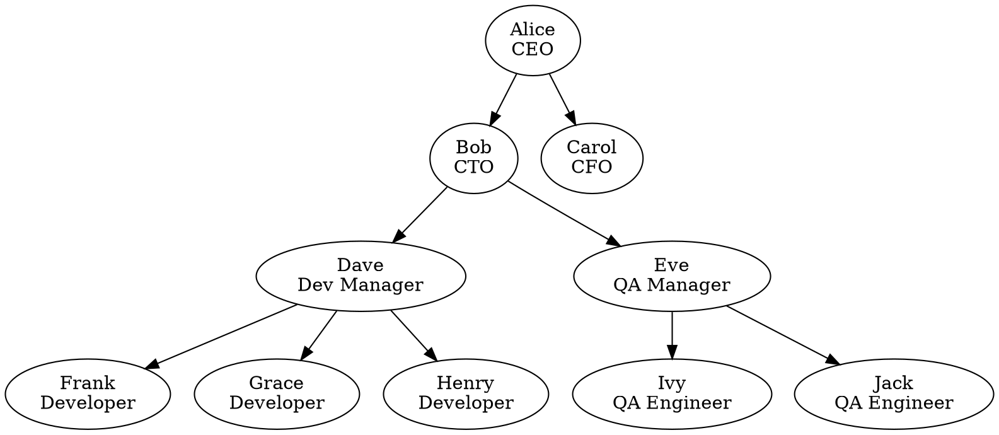
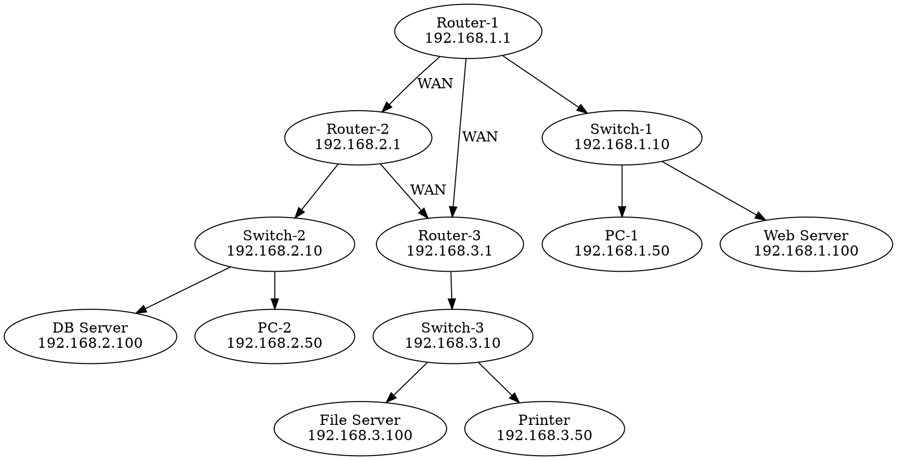
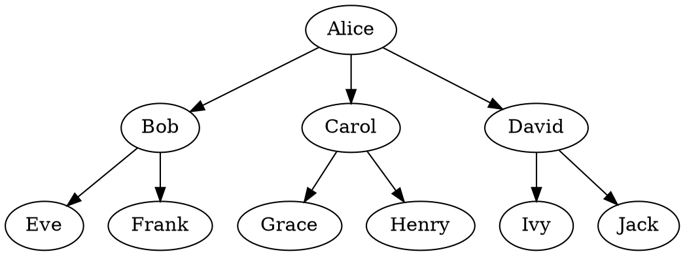
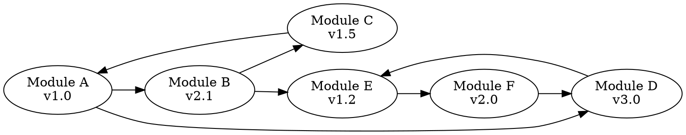

```gvpr
// Example 1: Highlight leaf nodes (employees with no subordinates)
// Usage: gvpr -f example1_highlight_leaves.gvpr example1_input.dot

BEGIN {
    printf("// Processing organizational chart to highlight leaf nodes\n");
}

// Process all nodes
N {
    // Check if this node has any outgoing edges (subordinates)
    // if (outdegree($) == 0) {
    //     // This is a leaf node (no subordinates)
    //     $.color = "red";
    //     $.style = "filled";
    //     $.fillcolor = "lightcoral";
    //     printf("// Highlighted leaf node: %s\n", $.name);
    // } else {
    //     // Manager node - make it blue
    //     $.color = "blue";
    //     $.style = "filled";
    //     $.fillcolor = "lightblue";
    // }

    $.color = "blue";
    $.style = "filled";
    $.fillcolor = "lightblue";
}

// Copy all edges unchanged
E {
    // Keep all edges as they are
}

END {
    printf("// Finished highlighting leaf nodes\n");
} 
```

```dot
widehyo@DESKTOP-UID0111:~/gitclone/playground/content_base/cli/gvpr$ gvpr -c -f example1_highlight_leaves.gvpr example1_input.dot 
// Processing organizational chart to highlight leaf nodes
digraph org_chart {
        graph [rankdir=TB];
        CEO     [color=blue,
                fillcolor=lightblue,
                label="Alice\nCEO",
                style=filled];
        CTO     [color=blue,
                fillcolor=lightblue,
                label="Bob\nCTO",
                style=filled];
        CEO -> CTO;
        CFO     [color=blue,
                fillcolor=lightblue,
                label="Carol\nCFO",
                style=filled];
        CEO -> CFO;
        DevMgr  [color=blue,
                fillcolor=lightblue,
                label="Dave\nDev Manager",
                style=filled];
        CTO -> DevMgr;
        QAMgr   [color=blue,
                fillcolor=lightblue,
                label="Eve\nQA Manager",
                style=filled];
        CTO -> QAMgr;
        Dev1    [color=blue,
                fillcolor=lightblue,
                label="Frank\nDeveloper",
                style=filled];
        DevMgr -> Dev1;
        Dev2    [color=blue,
                fillcolor=lightblue,
                label="Grace\nDeveloper",
                style=filled];
        DevMgr -> Dev2;
        Dev3    [color=blue,
                fillcolor=lightblue,
                label="Henry\nDeveloper",
                style=filled];
        DevMgr -> Dev3;
        QA1     [color=blue,
                fillcolor=lightblue,
                label="Ivy\nQA Engineer",
                style=filled];
        QAMgr -> QA1;
        QA2     [color=blue,
                fillcolor=lightblue,
                label="Jack\nQA Engineer",
                style=filled];
        QAMgr -> QA2;
}
// Finished highlighting leaf nodes
```


```dot
widehyo@DESKTOP-UID0111:~/gitclone/playground/content_base/cli/gvpr$ gvpr -c -f example1_highlight_leaves.gvpr example1_input.dot 
// Processing organizational chart to highlight leaf nodes
// Highlighted leaf node: CFO
// Highlighted leaf node: Dev1
// Highlighted leaf node: Dev2
// Highlighted leaf node: Dev3
// Highlighted leaf node: QA1
// Highlighted leaf node: QA2
digraph org_chart {
        graph [rankdir=TB];
        CEO     [color=blue,
                fillcolor=lightblue,
                label="Alice\nCEO",
                style=filled];
        CTO     [color=blue,
                fillcolor=lightblue,
                label="Bob\nCTO",
                style=filled];
        CEO -> CTO;
        CFO     [color=red,
                fillcolor=lightcoral,
                label="Carol\nCFO",
                style=filled];
        CEO -> CFO;
        DevMgr  [color=blue,
                fillcolor=lightblue,
                label="Dave\nDev Manager",
                style=filled];
        CTO -> DevMgr;
        QAMgr   [color=blue,
                fillcolor=lightblue,
                label="Eve\nQA Manager",
                style=filled];
        CTO -> QAMgr;
        Dev1    [color=red,
                fillcolor=lightcoral,
                label="Frank\nDeveloper",
                style=filled];
        DevMgr -> Dev1;
        Dev2    [color=red,
                fillcolor=lightcoral,
                label="Grace\nDeveloper",
                style=filled];
        DevMgr -> Dev2;
        Dev3    [color=red,
                fillcolor=lightcoral,
                label="Henry\nDeveloper",
                style=filled];
        DevMgr -> Dev3;
        QA1     [color=red,
                fillcolor=lightcoral,
                label="Ivy\nQA Engineer",
                style=filled];
        QAMgr -> QA1;
        QA2     [color=red,
                fillcolor=lightcoral,
                label="Jack\nQA Engineer",
                style=filled];
        QAMgr -> QA2;
}
// Finished highlighting leaf nodes
```




```gvpr
// example2_extract_servers.gvpr
// Example 2: Extract servers and their immediate connections
// Usage: gvpr -f example2_extract_servers.gvpr example2_network.dot

BEGIN {
    printf("// Extracting server subgraph from network topology\n");
    /// node_t server_nodes[100];  // Array to store server nodes
    node_t server_nodes[];  // Array to store server nodes
    int server_count = 0;
}

BEG_G {
    // Create a new graph for the output
    graph_t new_graph = graph("server_network", "D");
    new_graph.rankdir = "TB";
    new_graph.label = "Server Infrastructure";
}

// First pass: identify and clone server nodes
N [type == "server"] {
    printf("// Found server: %s\n", $.name);
    node_t new_node = clone(new_graph, $);
    new_node.shape = "box";
    new_node.style = "filled";
    new_node.fillcolor = "lightgreen";
    new_node.color = "darkgreen";
    
    // Store server node for later reference
    server_nodes[server_count] = $;
    server_count++;
}

// Second pass: find and clone nodes connected to servers
N [type != "server"] {
    edge_t e;
    int connected_to_server = 0;
    
    // Check outgoing edges
    for (e = fstout($); e; e = nxtout(e)) {
        if (e.head.type == "server") {
            connected_to_server = 1;
            break;
        }
    }
    
    // Check incoming edges
    if (!connected_to_server) {
        for (e = fstin($); e; e = nxtin(e)) {
            if (e.tail.type == "server") {
                connected_to_server = 1;
                break;
            }
        }
    }
    
    if (connected_to_server) {
        printf("// Including connected node: %s (type: %s)\n", $.name, $.type);
        /// node_t new_node = clone(new_graph, $);
        new_node = clone(new_graph, $);
        
        // Style based on type
        if ($.type == "switch") {
            new_node.shape = "diamond";
            new_node.fillcolor = "lightyellow";
        } else if ($.type == "router") {
            new_node.shape = "ellipse";
            new_node.fillcolor = "lightblue";
        }
        new_node.style = "filled";
    }
}

// Third pass: clone relevant edges
E {
    // Include edge if both nodes are in our subgraph
    int include_edge = 0;
    
    if (($.tail.type == "server") || ($.head.type == "server")) {
        include_edge = 1;
    } else {
        // Check if both nodes are connected to servers
        int tail_connected = 0, head_connected = 0;
        edge_t e2;
        
        for (e2 = fstout($.tail); e2; e2 = nxtout(e2)) {
            if (e2.head.type == "server") { tail_connected = 1; break; }
        }
        for (e2 = fstin($.tail); e2; e2 = nxtin(e2)) {
            if (e2.tail.type == "server") { tail_connected = 1; break; }
        }
        
        for (e2 = fstout($.head); e2; e2 = nxtout(e2)) {
            if (e2.head.type == "server") { head_connected = 1; break; }
        }
        for (e2 = fstin($.head); e2; e2 = nxtin(e2)) {
            if (e2.tail.type == "server") { head_connected = 1; break; }
        }
        
        if (tail_connected && head_connected) {
            include_edge = 1;
        }
    }
    
    if (include_edge) {
        printf("// Including edge: %s -> %s\n", $.tail.name, $.head.name);
        edge_t new_edge = clone(new_graph, $);
        new_edge.color = "darkgreen";
        new_edge.penwidth = "2";
    }
}

END_G {
    printf("// Server subgraph extraction complete\n");
    $O = new_graph;
} 
```

```dot
widehyo@DESKTOP-UID0111:~/gitclone/playground/content_base/cli/gvpr$ gvpr -f example2_extract_servers.gvpr example2_network.dot
// Extracting server subgraph from network topology
// Including connected node: Switch1 (type: switch)
// Including edge: Switch1 -> WebServer
// Including connected node: Switch2 (type: switch)
// Including edge: Switch2 -> DBServer
// Including connected node: Switch3 (type: switch)
// Including edge: Switch3 -> FileServer
// Found server: WebServer
// Found server: DBServer
// Found server: FileServer
// Server subgraph extraction complete
digraph server_network {
        graph [label="Server Infrastructure",
                rankdir=TB
        ];
        Switch1 [fillcolor=lightyellow,
                label="Switch-1\n192.168.1.10",
                shape=diamond,
                style=filled,
                type=switch];
        WebServer       [color=darkgreen,
                fillcolor=lightgreen,
                label="Web Server\n192.168.1.100",
                shape=box,
                style=filled,
                type=server];
        Switch1 -> WebServer    [color=darkgreen,
                penwidth=2];
        Switch2 [fillcolor=lightyellow,
                label="Switch-2\n192.168.2.10",
                shape=diamond,
                style=filled,
                type=switch];
        DBServer        [color=darkgreen,
                fillcolor=lightgreen,
                label="DB Server\n192.168.2.100",
                shape=box,
                style=filled,
                type=server];
        Switch2 -> DBServer     [color=darkgreen,
                penwidth=2];
        Switch3 [fillcolor=lightyellow,
                label="Switch-3\n192.168.3.10",
                shape=diamond,
                style=filled,
                type=switch];
        FileServer      [color=darkgreen,
                fillcolor=lightgreen,
                label="File Server\n192.168.3.100",
                shape=box,
                style=filled,
                type=server];
        Switch3 -> FileServer   [color=darkgreen,
                penwidth=2];
}
```



```gvpr
// example3_count_descendants.gvpr
// Example 3: Count descendants for each node in a tree
// Usage: gvpr -f example3_count_descendants.gvpr example3_tree.dot

BEGIN {
    printf("// Counting descendants for each node in the tree\n");
}

// Function to count descendants (non-recursive implementation)
int count_descendants(node_t n) {
    node_t queue[100];  // Queue for BFS
    int visited[100];   // Track visited nodes  
    int front = 0, rear = 0;
    int count = 0;
    int i;
    edge_t e;
    node_t current;
    
    // Initialize visited array
    for (i = 0; i < 100; i++) {
        visited[i] = 0;
    }
    
    // Add immediate children to queue
    for (e = fstout(n); e; e = nxtout(e)) {
        queue[rear] = e.head;
        visited[rear] = 1;
        rear++;
        count++;
    }
    
    // BFS to count all descendants
    while (front < rear) {
        current = queue[front];
        front++;
        
        // Add children of current node to queue
        for (e = fstout(current); e; e = nxtout(e)) {
            // Check if already visited
            int already_visited = 0;
            for (i = 0; i < rear; i++) {
                if (queue[i].name == e.head.name) {
                    already_visited = 1;
                    break;
                }
            }
            
            if (!already_visited) {
                queue[rear] = e.head;
                visited[rear] = 1;
                rear++;
                count++;
            }
        }
    }
    
    return count;
}

// Process all nodes
N {
    int desc_count = count_descendants($);
    string old_label = $.label;
    
    // Update the label to include descendant count
    if (desc_count > 0) {
        $.label = sprintf("%s\\n(%d descendants)", old_label, desc_count);
        $.style = "filled";
        
        // Color based on number of descendants
        if (desc_count >= 6) {
            $.fillcolor = "red";
            $.color = "darkred";
        } else if (desc_count >= 3) {
            $.fillcolor = "orange";  
            $.color = "darkorange";
        } else if (desc_count >= 1) {
            $.fillcolor = "yellow";
            $.color = "gold";
        }
    } else {
        // Leaf nodes
        $.label = sprintf("%s\\n(leaf)", old_label);
        $.style = "filled";
        $.fillcolor = "lightgreen";
        $.color = "darkgreen";
    }
    
    printf("// %s has %d descendants\n", $.name, desc_count);
}

// Keep all edges unchanged
E {
    $.color = "blue";
    $.penwidth = "2";
}

END {
    printf("// Finished counting descendants\n");
} 
```


```dot
widehyo@DESKTOP-UID0111:~/gitclone/playground/content_base/cli/gvpr$ gvpr -c -f example3_count_descendants.gvpr example3_tree.dot
// Counting descendants for each node in the tree
// A has 9 descendants
// B has 2 descendants
// C has 2 descendants
// D has 2 descendants
// E has 0 descendants
// F has 0 descendants
// G has 0 descendants
// H has 0 descendants
// I has 0 descendants
// J has 0 descendants
digraph family_tree {
        graph [rankdir=TB];
        A       [color=darkred,
                fillcolor=red,
                label="Alice\n(9 descendants)",
                style=filled];
        B       [color=gold,
                fillcolor=yellow,
                label="Bob\n(2 descendants)",
                style=filled];
        A -> B  [color=blue,
                penwidth=2];
        C       [color=gold,
                fillcolor=yellow,
                label="Carol\n(2 descendants)",
                style=filled];
        A -> C  [color=blue,
                penwidth=2];
        D       [color=gold,
                fillcolor=yellow,
                label="David\n(2 descendants)",
                style=filled];
        A -> D  [color=blue,
                penwidth=2];
        E       [color=darkgreen,
                fillcolor=lightgreen,
                label="Eve\n(leaf)",
                style=filled];
        B -> E  [color=blue,
                penwidth=2];
        F       [color=darkgreen,
                fillcolor=lightgreen,
                label="Frank\n(leaf)",
                style=filled];
        B -> F  [color=blue,
                penwidth=2];
        G       [color=darkgreen,
                fillcolor=lightgreen,
                label="Grace\n(leaf)",
                style=filled];
        C -> G  [color=blue,
                penwidth=2];
        H       [color=darkgreen,
                fillcolor=lightgreen,
                label="Henry\n(leaf)",
                style=filled];
        C -> H  [color=blue,
                penwidth=2];
        I       [color=darkgreen,
                fillcolor=lightgreen,
                label="Ivy\n(leaf)",
                style=filled];
        D -> I  [color=blue,
                penwidth=2];
        J       [color=darkgreen,
                fillcolor=lightgreen,
                label="Jack\n(leaf)",
                style=filled];
        D -> J  [color=blue,
                penwidth=2];
}
// Finished counting descendants

```




```gvpr
// example4_detect_cycles.gvpr
// Example 4: Detect and highlight circular dependencies
// Usage: gvpr -f example4_detect_cycles.gvpr example4_dependencies.dot

BEGIN {
    printf("// Detecting circular dependencies in the graph\n");
    int node_count = 0;
    int in_cycle[int];  // Track which nodes are in cycles
    int i;
    node_t temp;
    
    // Initialize cycle tracking
    for (i = 0; i < 100; i++) {
        in_cycle[i] = 0;
    }

    // Simple cycle detection using DFS-like approach
    int has_path_to(node_t from, node_t to, int max_depth) {
        edge_t e;
        int depth = 0;
        node_t queue[int];
        int visited[int];
        int front = 0, rear = 0;
        
        // Initialize visited array
        for (i = 0; i < 50; i++) {
            visited[i] = 0;
        }
        
        // Start with immediate successors of 'from'
        for (e = fstout(from); e; e = nxtout(e)) {
            if (e.head.name == to.name) {
                return 1;  // Direct path found
            }
            queue[rear] = e.head;
            visited[rear] = 1;
            rear++;
        }
        
        // BFS to find path within max_depth
        while (front < rear && depth < max_depth) {
            int current_level_size = rear - front;
            
            for (i = 0; i < current_level_size; i++) {
                node_t current = queue[front];
                front++;
                
                // Check successors of current node
                for (e = fstout(current); e; e = nxtout(e)) {
                    if (e.head.name == to.name) {
                        return 1;  // Path found
                    }
                    
                    // Check if already visited
                    int already_visited = 0;
                    int j;
                    for (j = 0; j < rear; j++) {
                        if (queue[j].name == e.head.name) {
                            already_visited = 1;
                            break;
                        }
                    }
                    
                    if (!already_visited && rear < 49) {
                        queue[rear] = e.head;
                        visited[rear] = 1;
                        rear++;
                    }
                }
            }
            depth++;
        }
        
        return 0;  // No path found within max_depth
    }

}

// First pass: identify nodes in cycles
N {
    node_t current = $;
    edge_t e;
    
    // Check if this node can reach itself through any of its successors
    for (e = fstout(current); e; e = nxtout(e)) {
        if (has_path_to(e.head, current, 10)) {
            in_cycle[node_count] = 1;
            printf("// Found cycle involving node: %s\n", current.name);
            break;
        }
    }
    
    node_count++;
}

// Second pass: style nodes based on cycle detection
N {
    int node_index = 0;
    
    // Find the index of current node
    for (temp = fstnode($G); temp; temp = nxtnode(temp)) {
        if (temp.name == $.name) {
            break;
        }
        node_index++;
    }
    
    if (in_cycle[node_index]) {
        // Node is part of a cycle - highlight in red
        $.style = "filled";
        $.fillcolor = "lightcoral";
        $.color = "red";
        $.penwidth = "3";
        $.label = sprintf("%s\\n[CIRCULAR DEP]", $.label);
    } else {
        // Normal node - style in green
        $.style = "filled";
        $.fillcolor = "lightgreen";
        $.color = "darkgreen";
    }
}

// Third pass: style edges
E {
    node_t tail_node = $.tail;
    node_t head_node = $.head;
    int tail_index = 0, head_index = 0;
    
    // Find indices for tail and head nodes
    for (temp = fstnode($G); temp; temp = nxtnode(temp)) {
        if (temp.name == tail_node.name) {
            break;
        }
        tail_index++;
    }
    
    for (temp = fstnode($G); temp; temp = nxtnode(temp)) {
        if (temp.name == head_node.name) {
            break;
        }
        head_index++;
    }
    
    // Check if this edge creates a back-edge (potential cycle)
    if (has_path_to(head_node, tail_node, 10)) {
        // This edge is part of a cycle
        $.color = "red";
        $.penwidth = "3";
        $.style = "dashed";
        $.label = "CYCLE";
        printf("// Cycle edge: %s -> %s\n", tail_node.name, head_node.name);
    } else {
        // Normal edge
        $.color = "blue";
        $.penwidth = "1";
    }
}

END {
    printf("// Finished cycle detection analysis\n");
} 
```


```dot
widehyo@DESKTOP-UID0111:~/gitclone/playground/content_base/cli/gvpr$ gvpr -c -f example4_detect_cycles.gvpr example4_dependencies.dot
// Detecting circular dependencies in the graph
// Found cycle involving node: ModuleA
// Cycle edge: ModuleA -> ModuleB
// Found cycle involving node: ModuleB
// Cycle edge: ModuleB -> ModuleC
// Found cycle involving node: ModuleC
// Cycle edge: ModuleC -> ModuleA
// Found cycle involving node: ModuleD
// Cycle edge: ModuleD -> ModuleE
// Found cycle involving node: ModuleE
// Cycle edge: ModuleE -> ModuleF
// Found cycle involving node: ModuleF
// Cycle edge: ModuleF -> ModuleD
digraph dependencies {
        graph [rankdir=LR];
        ModuleA [color=red,
                fillcolor=lightcoral,
                label="Module A\nv1.0\n[CIRCULAR DEP]",
                penwidth=3,
                style=filled];
        ModuleB [color=red,
                fillcolor=lightcoral,
                label="Module B\nv2.1\n[CIRCULAR DEP]",
                penwidth=3,
                style=filled];
        ModuleA -> ModuleB      [color=red,
                label=CYCLE,
                penwidth=3,
                style=dashed];
        ModuleD [color=red,
                fillcolor=lightcoral,
                label="Module D\nv3.0\n[CIRCULAR DEP]",
                penwidth=3,
                style=filled];
        ModuleA -> ModuleD      [color=blue,
                penwidth=1];
        ModuleC [color=red,
                fillcolor=lightcoral,
                label="Module C\nv1.5\n[CIRCULAR DEP]",
                penwidth=3,
                style=filled];
        ModuleB -> ModuleC      [color=red,
                label=CYCLE,
                penwidth=3,
                style=dashed];
        ModuleE [color=red,
                fillcolor=lightcoral,
                label="Module E\nv1.2\n[CIRCULAR DEP]",
                penwidth=3,
                style=filled];
        ModuleB -> ModuleE      [color=blue,
                penwidth=1];
        ModuleC -> ModuleA      [color=red,
                label=CYCLE,
                penwidth=3,
                style=dashed];
        ModuleD -> ModuleE      [color=red,
                label=CYCLE,
                penwidth=3,
                style=dashed];
        ModuleF [color=red,
                fillcolor=lightcoral,
                label="Module F\nv2.0\n[CIRCULAR DEP]",
                penwidth=3,
                style=filled];
        ModuleE -> ModuleF      [color=red,
                label=CYCLE,
                penwidth=3,
                style=dashed];
        ModuleF -> ModuleD      [color=red,
                label=CYCLE,
                penwidth=3,
                style=dashed];
}
// Finished cycle detection analysis
```


local Chain = {}
Chain.__index = Chain -- 메타테이블 설정: Chain 테이블에서 메소드를 찾도록 함

-- 생성자 함수 (새로운 Chain 인스턴스를 만듭니다)
function Chain.new(data)
  local self = {
    _data = data or {} -- 내부적으로 데이터를 저장할 필드
  }
  return setmetatable(self, Chain)
end

-- 리듀스
function Chain:reduce(func, init)
  local acc = init
  for i, v in ipairs(self._data) do
    if i == 1 then
      if init then
        acc = init
      else
        acc = v
        goto continue
      end
    end
    acc = func(acc, v)
    ::continue::
  end
  return acc
end


-- 현재 데이터를 가져오는 메소드 (체이닝의 끝)
function Chain:get()
  return self._data
end

```lua
local chain = require('util.chain')

-- Test the Chain class
local function test_chain()
    print("=== Testing Chain Class ===\n")
    
    -- Test 1: Basic constructor and get
    print("Test 1: Constructor and get()")
    local chain1 = chain.from({1, 2, 3, 4, 5})
    print("Data:", table.concat(chain1:get(), ", "))
    
    local chain2 = chain.from({})
    print("Empty chain:", #chain2:get())
    print()
    
    -- Test 2: Reduce with initial value
    print("Test 2: Reduce with initial value")
    local sum_with_init = chain1:reduce(function(acc, val)
        return acc + val
    end, 0)
    print("Sum with init 0:", sum_with_init) -- Expected: 15
    
    local sum_with_init_10 = chain1:reduce(function(acc, val)
        return acc + val
    end, 10)
    print("Sum with init 10:", sum_with_init_10) -- Expected: 25
    print()
    
    -- Test 3: Reduce without initial value
    print("Test 3: Reduce without initial value")
    local sum_no_init = chain1:reduce(function(acc, val)
        return acc + val
    end)
    print("Sum without init:", sum_no_init) -- Expected: 15
    print()
    
    -- Test 4: Reduce with different operations
    print("Test 4: Different reduce operations")
    local product = chain1:reduce(function(acc, val)
        return acc * val
    end, 1)
    print("Product:", product) -- Expected: 120
    
    local concat_strings = chain.from({"Hello", " ", "World", "!"})
    local sentence = concat_strings:reduce(function(acc, val)
        return acc .. val
    end, "")
    print("Concatenated:", sentence) -- Expected: "Hello World!"
    print()
    
    -- Test 5: Reduce to find max
    print("Test 5: Find maximum")
    local max_val = chain1:reduce(function(acc, val)
        return math.max(acc, val)
    end)
    print("Max value:", max_val) -- Expected: 5
    print()
    
    -- Test 6: Empty array edge case
    print("Test 6: Empty array edge cases")
    local empty_chain = chain.from({})
    local empty_sum = empty_chain:reduce(function(acc, val)
        return acc + val
    end, 100)
    print("Empty array with init:", empty_sum) -- Expected: 100
    
    -- This might cause issues if not handled properly
    local empty_no_init = empty_chain:reduce(function(acc, val)
        return acc + val
    end)
    print("Empty array no init:", empty_no_init) -- Expected: nil
    print()
    
    -- Test 7: Single element
    print("Test 7: Single element")
    local single = chain.from({42})
    local single_with_init = single:reduce(function(acc, val)
        return acc + val
    end, 8)
    print("Single element with init:", single_with_init) -- Expected: 50
    
    local single_no_init = single:reduce(function(acc, val)
        return acc + val
    end)
    print("Single element no init:", single_no_init) -- Expected: 42
    print()
    
    -- Test 8: Complex objects
    print("Test 8: Complex objects")
    local people = chain.from({
        {name = "Alice", age = 30},
        {name = "Bob", age = 25},
        {name = "Carol", age = 35}
    })
    
    local total_age = people:reduce(function(acc, person)
        return acc + person.age
    end, 0)
    print("Total age:", total_age) -- Expected: 90
    
    local names = people:reduce(function(acc, person)
        return acc .. person.name .. " "
    end, "")
    print("Names:", names) -- Expected: "Alice Bob Carol "
    print()
    
    print("=== All tests completed ===")
end

-- Run the tests
test_chain()
```


```lua
-- impl1
function Chain:reduce(func, init)
  if #self._data == 0 then
    return init
  end

  local acc
  for i, v in ipairs(self._data) do
    if i == 1 then
      if init then
        acc = init
      else
        acc = v
        goto continue
      end
    end
    acc = func(acc, v)
    ::continue::
  end
  return acc
end


-- impl2
function Chain:reduce(func, init)
  if #self._data == 0 then
    return init
  end

  local acc, data
  if init then
    data = self._data
    acc = init
  else
    data = {unpack(self._data, 2)}
    acc = self._data[1]
  end

  for i, v in ipairs(data) do
    acc = func(acc, v)
  end
  return acc
end

-- reduce
function Chain:reduce(func, init)
  local len = #self._data
  if len == 0 then
    return init
  end

  local acc, start_index

  if init then
    start_index = 1
    acc = init
  else
    start_index = 2
    acc = self._data[1]
  end

  for i = start_index, len do
    acc = func(acc, self._data[i])
  end

  return acc
end

```


```lua
local data = {1,2,3,4,5}
print(unpack(data, 2))
print({unpack(data, 2)})
print(type(unpack(data, 2)))
print(type({unpack(data, 2)}))

local chain = require('util.chain')
local data = {1,2,3,4,5}

print(chain.from(data):reduce(function(acc, cur) return acc + cur end))
print(chain.from(data):reduce(function(acc, cur) return acc + cur end, 10))

-- 2 3 4 5
-- table: 0x79c320d95c18
-- number
-- table
-- 15
-- 25
```


```lua
-- ftplugin/python.lua
local b_local = { buffer = 0 }
vim.api.nvim_set_keymap('n', '<leader>pf', ':! black %<CR>', silent_noremap)
```


```gvpr
// Example 5: Simple node and edge filtering with attribute modification
// Usage: gvpr -f example5_simple_filter.gvpr input.dot

BEGIN {
    printf("// Simple filtering and styling example\n");
}

// Style all nodes with specific patterns
N {
    // Make all node labels uppercase and add a border
    $.label = toupper($.label);
    $.style = "filled,bold";
    $.penwidth = "2";
    
    // Color nodes based on their name patterns
    if (match($.name, "^[Aa].*")) {
        // Names starting with A or a - blue
        $.fillcolor = "lightblue";
        $.color = "blue";
    } else if (match($.name, "^[Bb].*")) {
        // Names starting with B or b - green  
        $.fillcolor = "lightgreen";
        $.color = "darkgreen";
    } else {
        // All other names - yellow
        $.fillcolor = "lightyellow";
        $.color = "orange";
    }
    
    printf("// Styled node: %s\n", $.name);
}

// Filter and style edges
E {
    // Only keep edges where both nodes have been processed
    if ($.tail && $.head) {
        $.color = "purple";
        $.penwidth = "2";
        
        // Add arrow labels
        $.label = sprintf("%s→%s", $.tail.name, $.head.name);
        $.fontsize = "8";
        $.fontcolor = "red";
        
        printf("// Kept edge: %s -> %s\n", $.tail.name, $.head.name);
    }
}

END {
    printf("// Filtering complete\n");
} 

```


```dot
widehyo@DESKTOP-UID0111:~/gitclone/playground/content_base/cli/gvpr$ gvpr -f example5_simple_filter.gvpr example1_input.dot 
// Simple filtering and styling example
// Styled node: CEO
// Kept edge: CEO -> CTO
// Kept edge: CEO -> CFO
// Styled node: CTO
// Kept edge: CTO -> DevMgr
// Kept edge: CTO -> QAMgr
// Styled node: CFO
// Styled node: DevMgr
// Kept edge: DevMgr -> Dev1
// Kept edge: DevMgr -> Dev2
// Kept edge: DevMgr -> Dev3
// Styled node: QAMgr
// Kept edge: QAMgr -> QA1
// Kept edge: QAMgr -> QA2
// Styled node: Dev1
// Styled node: Dev2
// Styled node: Dev3
// Styled node: QA1
// Styled node: QA2
// Filtering complete

```
