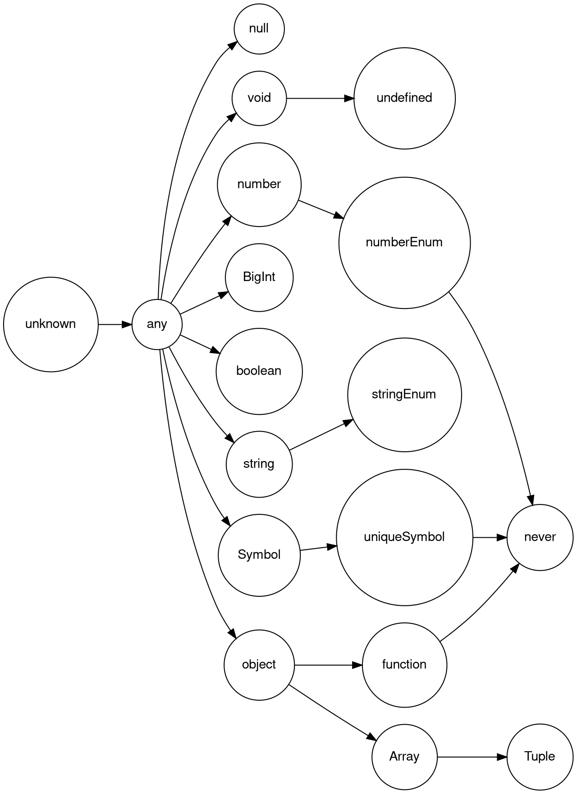

- javascript types
  - `undefined`
  - null
  - Boolean
  - String
  - Symbol
  - Numeric(Number and BigInt)
  - Object

- 객체타입 in typescript
  - `object`
  - {}
  - `array`
  - `type`, `interface`
  - `function`
  - `any`

```surrund_backtick
:reg q
Type Name Content
  c  "q   yiwcw``^["0P
```




```ts
const fn = () => {}
const array = [1, "string", fn];

console.log(typeof array);
console.log(Object.prototype.toString.call(array));
```


